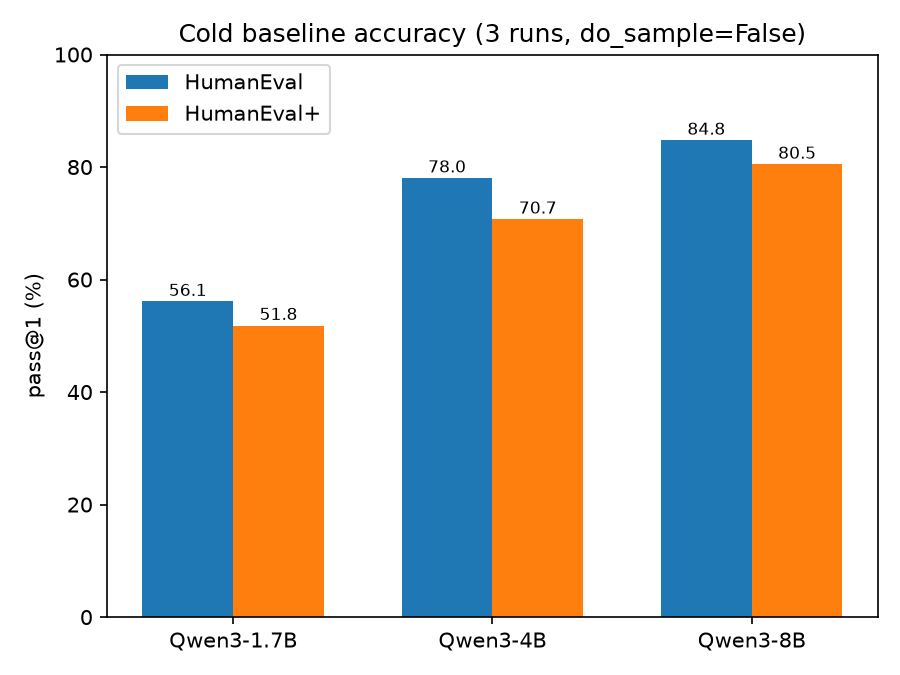
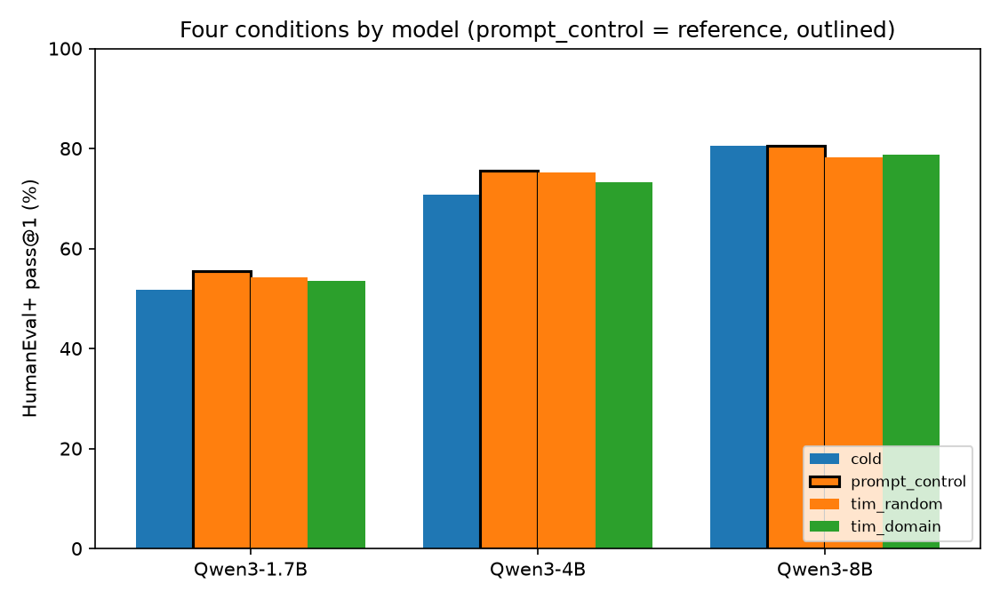
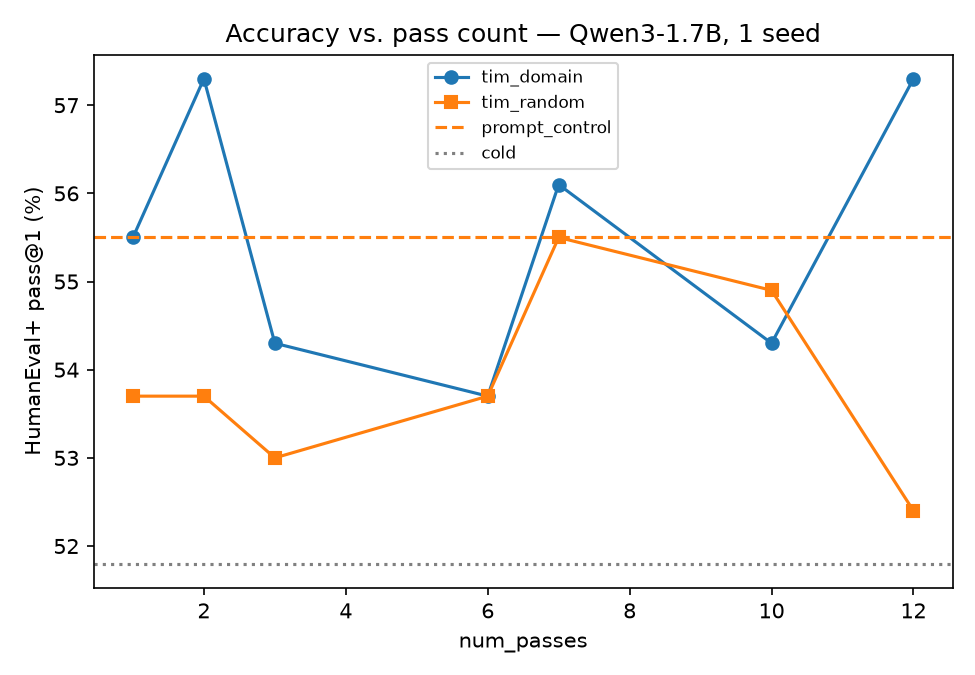
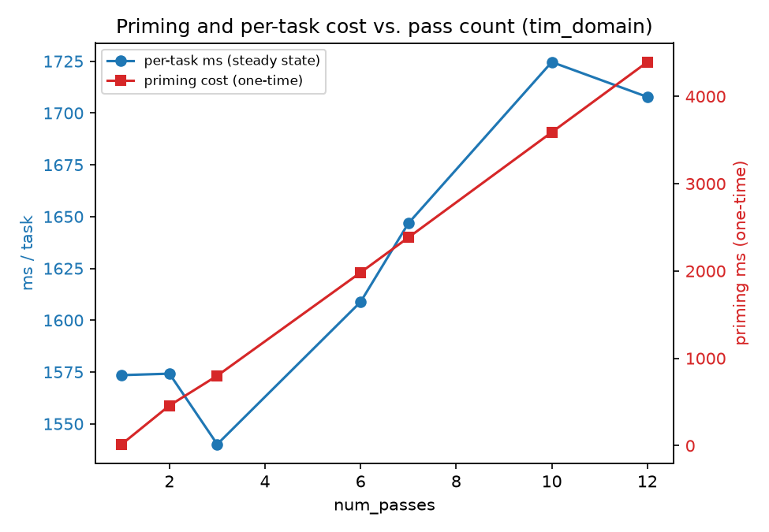
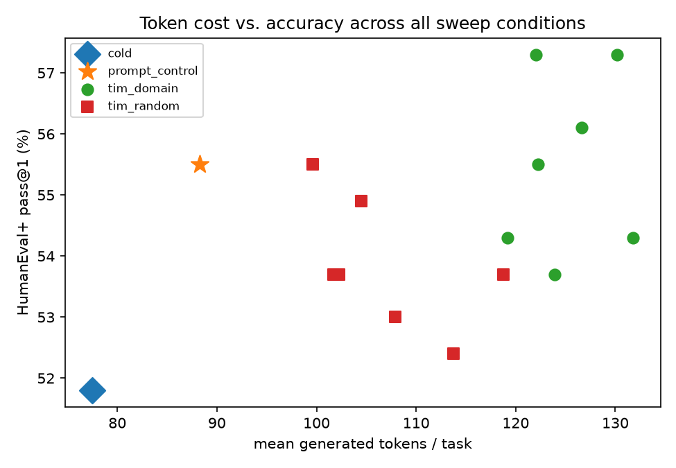
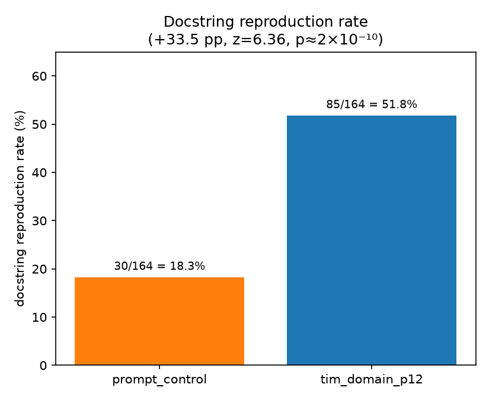
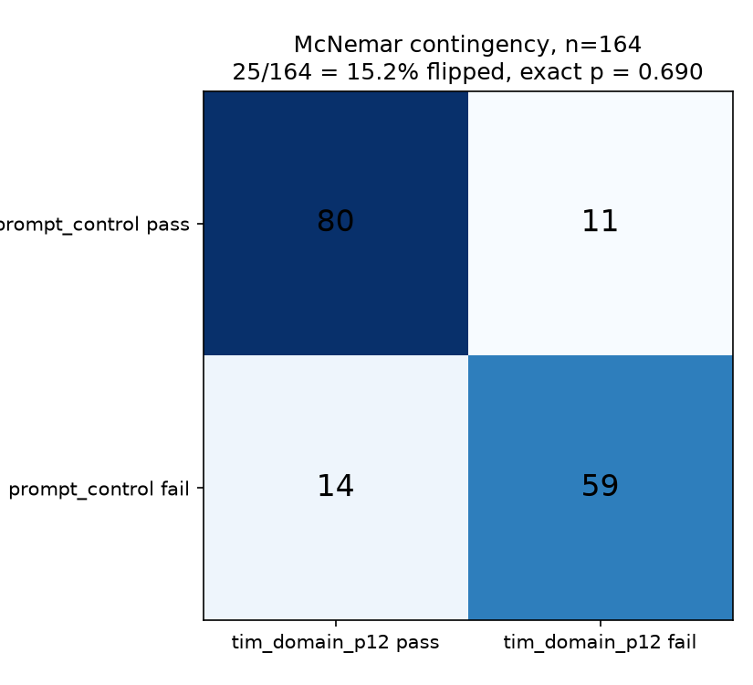

# TIM — Thinking Initiation Machines

TIM injects structured content directly into a language model's KV cache —
rather than into the prompt — to shape its generative prior before a query
arrives. Across three Qwen3 models (1.7B, 4B, 8B) on HumanEval+, KV-cache
priming produces large, statistically significant changes in generation
behavior: output style (docstring reproduction +33.5 pp, 2.83×,
p ≈ 2×10⁻¹⁰), output length (+47% tokens), and which specific problems get
solved (15.2% of outcomes flip) — but no significant change in overall
correctness (McNemar exact p = 0.690), at a 1.3–1.7× throughput cost relative
to `cold` and a `prompt_control` condition that matched or beat every
KV-injection arm on all three models. Latent conditioning demonstrably works.
What it modulates is stylistic conformity, not reasoning capability.

## Key findings

- **`prompt_control` — the same persona text delivered in the prompt instead
  of the KV cache — matched or beat every TIM arm on every model.** Qwen3-8B:
  80.5% vs. 78.3% (`tim_random`) / 78.7% (`tim_domain`). Since prompt tokens
  become KV cache entries during prefill, this is the ablation that decides
  whether KV injection does anything prompting doesn't.
- **TIM does not change accuracy.** Pass/fail outcomes agree between
  `prompt_control` and `tim_domain_p12` on 139/164 tasks; McNemar's exact test
  on the 25 discordant tasks gives p = 0.690 — no evidence the two conditions
  differ in correctness.
- **TIM does change what the model writes.** Docstring reproduction rate goes
  from 18.3% (`prompt_control`) to 51.8% (`tim_domain_p12`) — a +33.5 pp,
  2.83× increase, two-proportion z = 6.36, p ≈ 2×10⁻¹⁰. Mean output length
  rises 47% (88.3 → 130.2 tokens/task) with the median rising more than the
  mean (+63% vs. +47%), indicating the whole distribution shifted, not a few
  runaway outputs.
- **15.2% of task outcomes flip** between `prompt_control` and
  `tim_domain_p12` (14 TIM-only passes, 11 prompt-only passes) for a net gain
  of 3 tasks — 8.3 flips per net gain. Priming reshuffles roughly one in
  seven outcomes without moving the aggregate hit rate.
- **The slowdown is not attention cost.** Throughput is nearly flat across a
  6.5× longer KV cache (78.2 → 76.2 tok/s); the extra wall time comes from the
  model generating more tokens per task, not from processing a longer cache
  more slowly. A cache-size accounting check (28 layers × 8 KV heads × 128
  head dim × 2 (K,V) × 2 bytes = 112 KB/token) predicts 91.0 MB for two
  coexisting 416-token caches (the primed cache plus its per-task
  `copy.deepcopy`); measured peak-memory delta was 92.2 MB, a ~1.3% match.

## Figures

All figures are generated by `scripts/make_plots.py` directly from the JSON
in `logs/` and `experiment-2/logs/` — nothing here is hand-plotted.


Cold HumanEval / HumanEval+ pass@1 for the three models, averaged over 3
identical greedy runs (std ≈ 0).


HumanEval+ under all four conditions, three models. `prompt_control` is
outlined as the reference every TIM arm must beat.


Qwen3-1.7B accuracy vs. `num_passes` (1–12), one seed. Both arms oscillate
around `prompt_control` with no upward trend as passes increase.


Per-task steady-state cost vs. one-time priming cost as `num_passes` grows.
Priming cost scales linearly (~400 ms/pass); per-task cost grows much more
slowly.


Mean generated tokens/task vs. HumanEval+ across every sweep condition.
Token cost fans out across TIM conditions while accuracy stays in a narrow
band — more tokens are not buying more correctness.


The headline effect: `tim_domain_p12` reproduces the problem's docstring in
its completion 2.83× as often as `prompt_control`.


Paired pass/fail outcomes, `prompt_control` vs. `tim_domain_p12`, same 164
tasks. Off-diagonal cells (churn) are large; the test on them is not
significant.

## Results

### Cold baselines (3 identical runs, `do_sample=False`)

| Model | HumanEval | HumanEval+ |
|---|---|---|
| Qwen3-1.7B | 56.10% | 51.83% |
| Qwen3-4B | 78.05% | 70.73% |
| Qwen3-8B | 84.76% | 80.49% |

Std across the 3 runs is 0.00% (up to float noise), confirming determinism
under greedy decoding. The Qwen3 technical report (arXiv 2505.09388) reports
67.65/63.53/52.70 for these model sizes, but those figures are *base* models
averaged over four benchmarks (HumanEval, MBPP, HumanEval+, MBPP+), not an
instruct-model HumanEval+ number — no directly comparable published figure
exists, so the table above is a new data point rather than a reproduction.

### Main experiment — HumanEval+, 3 seeds

| Model | `prompt_control` | `tim_random` (mean of 3 seeds) | `tim_domain` (mean of 3 seeds) |
|---|---|---|---|
| Qwen3-8B | **80.5%** | 78.3% | 78.7% |
| Qwen3-4B | **75.6%** | 75.2% | 73.2% |
| Qwen3-1.7B | **55.5%** | 54.3% | 53.4% |

`prompt_control` matched or beat every KV-injection arm on all three models.
Full per-seed numbers: `logs/tim/all_models_combined_results.json`.

### Pass sweep — Qwen3-1.7B, 1 seed, `num_passes` ∈ {1,2,3,6,7,10,12}

| passes | `tim_domain` HE+ | `tim_random` HE+ | prime ms | cache len | per-task ms |
|---|---|---|---|---|---|
| 1 | 55.5% | 53.7% | 15.1 | 64 | 1573.5 |
| 2 | 57.3% | 53.7% | 458.5 | 96 | 1574.2 |
| 3 | 54.3% | 53.0% | 800.2 | 128 | 1540.1 |
| 6 | 53.7% | 53.7% | 1982.6 | 224 | 1608.8 |
| 7 | 56.1% | 55.5% | 2383.2 | 256 | 1646.8 |
| 10 | 54.3% | 54.9% | 3588.7 | 352 | 1724.6 |
| 12 | 57.3% | 52.4% | 4392.6 | 416 | 1707.8 |

Reference: `cold` = 51.8% HE+ at 990.2 ms/task; `prompt_control` = 55.5% HE+
at 1131.3 ms/task (1.14× cold). Accuracy is flat within noise across the
sweep in both arms; priming cost is linear in pass count (~400 ms/pass,
64→416 cache tokens); per-task cost ranges 1.31–1.74× cold depending on
condition. Source: `experiment-2/logs/tim_passes/Qwen_Qwen3-1.7B/sweep_results.json`.

### Docstring reproduction rate (Qwen3-1.7B, `p12`, seed 0)

| condition | docstring rate |
|---|---|
| `prompt_control` | 30/164 = **18.3%** |
| `tim_domain_p12` | 85/164 = **51.8%** |

+33.5 pp, 2.83×, two-proportion z = 6.36, p ≈ 2×10⁻¹⁰, 95% CI on the
difference [23.9%, 43.2%]. Contrast with the corresponding accuracy effect on
the same run/tasks/seed:

| effect | Δ | z | p |
|---|---|---|---|
| docstring rate | +33.5 pp | **6.36** | **2×10⁻¹⁰** |
| HumanEval+ accuracy | +1.8 pp | 0.33 | 0.74 |

### Paired analysis (McNemar), `prompt_control` vs. `tim_domain_p12`

|  | `tim_domain_p12` pass | `tim_domain_p12` fail | total |
|---|---|---|---|
| **`prompt_control` pass** | 80 | 11 | 91 |
| **`prompt_control` fail** | 14 | 59 | 73 |
| **total** | 94 | 70 | 164 |

McNemar exact p = 0.690 (binomial test on the 25 discordant pairs, b=11,
c=14). 25/164 tasks (15.2%) changed outcome — 14 TIM-only, 11 prompt-only —
for a net gain of 3, i.e. 8.3 flips per net gain. Pass is defined as passing
*both* the original HumanEval tests and the EvalPlus extra tests
(`base_status == plus_status == "pass"` in the `*.eval_results.json` files),
matching EvalPlus's own `pass@1 (base + extra)` metric.

## Method

### Conditions

| condition | description |
|---|---|
| `cold` | no priming — floor |
| `prompt_control` | persona sentence prepended to the prompt text — the bar every TIM arm must beat |
| `tim_random` | KV cache prefilled with uniformly random vocabulary tokens |
| `tim_domain` | KV cache prefilled with 70% Python keywords/builtins/dunders, 30% random |

Setup: Qwen3-1.7B / 4B / 8B (instruct), EvalPlus HumanEval/HumanEval+
(n=164), greedy decoding (`do_sample=False`), `enable_thinking=False`,
`max_new_tokens=768`, `device_map="sequential"`.

Prompt tokens and KV-cache tokens undergo the same forward computation during
prefill — a prompt prefix *is* a KV cache once it's been processed. The only
question that isolates whether KV injection does anything a prompt doesn't is
therefore whether priming the cache directly beats delivering the same
content through the prompt. `prompt_control` uses the exact same persona
text as the domain conditions (`DOMAIN_PERSONA_TEXT` in `tim.py`), prepended
to the problem text instead of injected via `past_key_values`. This is why
`prompt_control`, not `cold`, is the reference condition throughout.

### Priming mechanism (`tim_primer.py` / `experiment-2/tim_primer.py`, `TIMPrimer.prime()`)

- **Stage 1 — vocabulary-lens noise.** Sample `noise_length` (default 64)
  token IDs directly from the vocabulary — never decode-then-re-tokenize,
  since BPE does not round-trip losslessly. With no domain pool, sampling is
  100% uniform random (`tim_random`). With a domain pool, 70% of IDs are
  drawn from the pool and 30% uniform random, then shuffled (`tim_domain`).
  Special tokens (chat-template markers, `<think>`, etc.) are excluded by ID,
  not by a guessed numeric offset. The main 3-seed run's domain pool comes
  from tokenizing a short descriptive sentence (`DOMAIN_NAME =
  "python programming code function algorithm"` in the root `tim.py`); the
  pass-sweep run replaces this with
  `PYTHON_DOMAIN_WORDS` in `experiment-2/tim.py` — 211 real entries from
  `keyword.kwlist`, `dir(builtins)`, and curated dunders/operators, each
  tokenized independently so short syntax tokens aren't diluted by
  surrounding sentence context.
- **Stage 2 — iterative passes (`num_passes` > 1, pass-sweep code path
  only).** Pass 1 prefills the noise into an initial KV cache. Each
  subsequent pass samples `think_tokens` (default 32) "proto-thought" tokens
  one at a time from the model's own output distribution given the current
  cache — greedy if `prime_temperature <= 0`, else top-k sampled — appending
  each to the cache, so the cache genuinely accumulates across passes. Under
  `chain_mode="reseed"` a fresh noise chunk is injected at the start of every
  pass; under `"persistent"` (the default) the chain just continues. The
  earlier implementation in the root `tim_primer.py` collapsed every pass
  into a single `model.generate()` call, making `num_passes` observationally
  a no-op; this was rewritten for the pass sweep so each pass is a separate,
  timed step. Only `experiment-2/exp-2.py` uses the rewritten version — the
  main 3-seed run (`logs/tim/`) used the earlier single-call version with
  `num_passes=1`.
- **Stage 3 — persona conditioning (optional).** A persona/domain text can be
  prefilled on top of the noise cache via one more forward pass. Not used by
  the main runs (`prompt_control` delivers this text through the prompt
  instead, by design — see above).

### Cache isolation (`copy.deepcopy`)

`model.generate(past_key_values=...)` mutates the cache object in place,
appending new tokens as they're generated. Every entrypoint (`tim.py`'s
`run_condition`, `exp-2.py`'s `timed_generate`) therefore takes a fresh
`copy.deepcopy()` of the primed cache before each task. Without this, a
task's generated tokens would leak into the "warm" cache used by the next
task, growing unbounded over the loop and silently changing what later tasks
are conditioned on. The pass-sweep code measures this deepcopy separately
(`deepcopy_ms`) since it grows with cache length and is a real per-task cost
that a production system with prefix caching would not pay.

## Repository layout

```
config.py                    qwen_models list (Qwen3-1.7B/4B/8B repo IDs)
utils.py                     model download/path helpers (HF snapshot_download, local mirror under models/)
logger.py                    environment/hardware/model-config audit (writes logs/model_audit_*.json)
Evalplus_Baseline.py         cold-baseline harness: 3 runs x 3 models on HumanEval/HumanEval+
tim_primer.py                TIMPrimer — noise generation + priming (single-generate-call pass loop)
tim.py                       main 4-condition harness (cold/prompt_control/tim_random/tim_domain), 3 seeds
summary_evalplus.py          aggregates *eval_results.json into mean +/- std tables and combined_paper_summary.json

experiment-2/                pass-count sweep + efficiency benchmark, built on a rewritten primer
  config.py, utils.py          same as root
  tim.py                       condition definitions + PYTHON_DOMAIN_WORDS vocabulary (imported by exp-2.py;
                                its own run_condition/main are unused — exp-2.py defines its own with per-task
                                copy.deepcopy)
  tim_primer.py                rewritten TIMPrimer with genuinely iterative multi-pass priming and per-pass timing
  exp-2.py                     pass-sweep + timing entrypoint (run_tim_passes_timing equivalent)

scripts/
  make_plots.py               regenerates all docs/figures/*.png from the JSON in logs/ and experiment-2/logs/
  docstring_rate.py            standalone docstring-reproduction audit over every *-sanitized.jsonl in the repo

docs/figures/                 generated PNGs (see Figures above)

logs/
  model_audit_*.json           hardware/package/model-config snapshot
  evalplus_baseline/           3 rounds x 3 models cold-baseline output (humaneval_1/2/3), combined_paper_summary.json
  tim/                          main experiment output, one dir per model, all_models_combined_results.json
  (experiment-2/logs/tim_passes/  pass-sweep output, one dir per model, sweep_results.json, all_models_pass_sweep.json)
```

`logger.py` currently fails at import (`from config import qwen_models,
hf_token` — `config.py` does not define `hf_token`); the token is loaded via
`.env` + `python-dotenv` in every other entrypoint instead. Not fixed here
since it's outside this documentation pass, but worth knowing before running
it directly.

`models/` (local HF snapshot mirror, tens of GB) and `.idea/` are gitignored
and not part of the repository.

## Reproducing

```bash
pip install torch transformers accelerate huggingface_hub evalplus tqdm python-dotenv

# .env in the repo root, used by utils.py / Evalplus_Baseline.py / tim.py
echo "hf_token=<your HuggingFace token>" > .env
```

Cold baselines (3 rounds x all models in `config.qwen_models`, no CLI flags):

```bash
python Evalplus_Baseline.py
```

Main 4-condition experiment (`tim.py`, root):

```bash
python tim.py --model Qwen/Qwen3-1.7B --num_seeds 3
# --model         single model id, e.g. Qwen/Qwen3-1.7B (default: all of config.qwen_models)
# --num_seeds     seeds for tim_random/tim_domain (default 3)
# --noise_length  Stage-1 noise token count (default 64)
# --max_new_tokens (default 768)
# --skip_cold     skip the cold condition (reuse existing baseline results)
```

Pass-count sweep + timing benchmark (`experiment-2/exp-2.py`):

```bash
cd experiment-2
python exp-2.py --model Qwen/Qwen3-1.7B --limit 30          # quick timing pass, ~30 tasks
python exp-2.py --model Qwen/Qwen3-1.7B                     # full scored sweep, matches sweep_results.json
python exp-2.py --passes 1 3 7 12 --chain_mode reseed        # custom pass counts / reseed chain variant
# --passes            pass counts to sweep (default 1 2 3 6 7 10 12)
# --arms              domain / random / both (default both)
# --num_seeds         seeds per (pass,arm) (default 1)
# --noise_length      (default 64)
# --think_tokens      proto-thought tokens generated per pass after the first (default 32)
# --chain_mode        persistent | reseed (default persistent)
# --prime_temperature 0 => greedy proto-thoughts (default 0.8)
# --prime_top_k       (default 50)
# --max_new_tokens    (default 768)
# --limit             use only the first N tasks (recommended for timing runs)
# --no_score          skip EvalPlus scoring (pure timing run)
```

Aggregation and analysis:

```bash
python summary_evalplus.py logs/evalplus_baseline      # mean +/- std tables, combined_paper_summary.json
python scripts/docstring_rate.py                       # docstring-reproduction audit, all *-sanitized.jsonl
python scripts/make_plots.py                           # regenerate docs/figures/*.png
```

Environment used for the reported runs: 2x NVIDIA RTX 5060 Ti,
torch 2.11.0+cu130, transformers 5.13.1, accelerate 1.13.0 (from
`logs/model_audit_20260715_000534.json`). `torch.backends.cudnn.deterministic`
was not set for these runs; determinism was instead verified empirically (3
identical `Evalplus_Baseline.py` rounds, 0.00% std under greedy decoding).

## Limitations

- Single benchmark family (HumanEval+), single model family (Qwen3).
- Pass sweep run at 1 seed per cell; only the main 3-seed experiment has
  seed-level variance.
- Qwen3-8B initially ran with CPU offload; its timing is not comparable to
  1.7B/4B.
- Early pilot results (0→100% on `lru_cache`, 5,352→2,861 ms) were n=1 and
  are superseded — the controlled study reverses the timing claim.
- The 70/30 domain/random noise split is an inherited default with no
  ablation.
- `num_passes` was a no-op in the root `tim_primer.py` (collapsed to one
  `generate()` call); the iterative per-pass loop was rewritten in
  `experiment-2/tim_primer.py`, and only the pass sweep uses it — the main
  3-seed experiment ran with the earlier, non-iterative version.
- The initial domain vocabulary (root `tim.py`, main experiment) was a single
  short descriptive sentence; the pass-sweep version (`experiment-2/tim.py`)
  replaced it with 211 real Python keywords/builtins/dunders.
- The McNemar and docstring-rate analyses above are computed on one
  model/seed/pass-count cell (Qwen3-1.7B, `p12`, seed 0); they have not been
  repeated across models or seeds.

## Related work

| work | relation |
|---|---|
| Prefix-tuning (Li & Liang 2021, arXiv 2101.00190) | Closest family — literally injects learned K/V at every layer. TIM is prefix-tuning with *unlearned* prefixes; the optimization step is plausibly what lets learned prefixes beat prompts where TIM's unlearned ones don't. |
| Pause/filler tokens (Goyal et al., ICLR 2024; Pfau et al., COLM 2024) | Extra computation tokens help, but only when the model is trained with them present. |
| Quiet-STaR (Zelikman et al., COLM 2024) | Generates explicit rationales before answering; trained, not a prefix trick. |
| Prefix caching (vLLM APC, Anthropic, Gemini) | Kills the efficiency claim for TIM as deployed: compute-prefix-once is standard, lossless, production-grade infrastructure, so `prompt_control`'s prefix can be cached just as cheaply as a KV-injected one. |
| Cache steering (Belitsky et al., 2025, arXiv 2507.08799) | One-shot steering vector applied to prompt KV, rather than a sampled/generated prefix. |
| Memory Inception (Liu et al., 2026, arXiv 2605.06225) | Closest existing empirical result: injects text-derived KV banks and runs the same prompt-vs-KV ablation, finding KV injection competitive with prompting — consistent with the `prompt_control` finding here. |
| KV compression (CommVQ arXiv 2506.18879; residual-VQ arXiv 2410.15704; KIVI; H2O) | Targets memory footprint, not priming; relevant to future work on compressed-codebook priming. |
| Latent reasoning (Coconut, Hao et al., COLM 2025) | Trained latent recurrence in a continuous space; TIM's multi-pass mechanism is an unlearned, discrete-token analog. |
| Distraction (Shi et al., ICML 2023) | Irrelevant context degrades performance — consistent with `tim_random` underperforming `tim_domain` here. |
| Default mode network (Raichle et al., PNAS 2001) | Motivation only, not a mechanism claim: LLMs start every inference from zero internal state, unlike a brain with baseline activity between tasks. |

## Future work

- Compressed-codebook priming: replace raw-token KV injection with a learned
  or compressed representation (CommVQ, residual-VQ) to test whether the
  docstring-conformity effect survives compression, and whether compression
  changes the accuracy-neutrality result.
- A 2x2 interaction test crossing domain/random noise with static/windowed
  cache management, to separate the content effect from the recency/decay
  effect of a long static prefix.
- A dose-response curve across noise_length and pass count with multiple
  seeds per cell, to get real error bars on the pass-sweep trends shown here.
- A non-code benchmark (e.g. a reasoning or QA task) to test whether the
  docstring-reproduction-style effect is specific to code generation or a
  general artifact of KV priming.

## Citation

```
@misc{tim2026,
  title  = {Thinking Initiation Machines: Inference-Time Latent Conditioning via KV-Cache Priming},
  author = {Sohith Vishnu},
  year   = {2026},
  note   = {https://github.com/sohithvishnu/thinking-initiation-machines}
}
```

## License

No license file is currently present in this repository.
